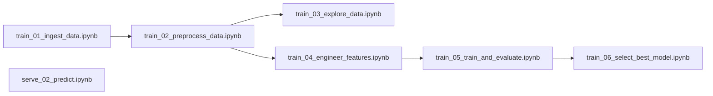

# home-co2-forecast

A set of notebooks that:
- extract a history of CO2 sensor readings,
- use several ML algorithms to train on the dataset in order to predict a future value,
- log the runs in mlflow,
- choose the feature set, model, and model parameters with the best predicting power,
- predict a target value using an input dataset and the fitted model.  

## List of the notebooks

| Notebook | Purpose |
| --- | --- |
| [`train_01_ingest_data.ipynb`](notebooks/train_01_ingest_data.ipynb) | Ingest data from source |
| [`train_02_preprocess_data.ipynb`](notebooks/train_02_preprocess_data.ipynb) | Preprocess data |
| [`train_03_explore_data.ipynb`](notebooks/train_03_explore_data.ipynb) | Perform exploratory data analysis |
| [`train_04_engineer_features.ipynb`](notebooks/train_04_engineer_features.ipynb) | Engineer features |
| [`train_05_train_and_evaluate.ipynb`](notebooks/train_05_train_and_evaluate.ipynb) | Run and log experiments |
| [`train_06_select_best_model.ipynb`](notebooks/train_06_select_best_model.ipynb) | Read logs and select the best run |
| [`serve_02_predict.ipynb`](notebooks/serve_02_predict.ipynb) | Read input data and fitted model, predict target value |

## DAG for running the notebooks

