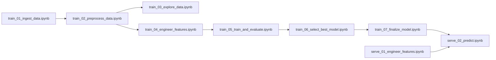
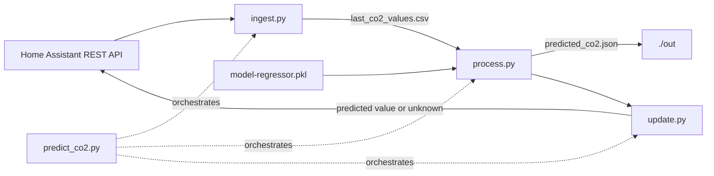

# home-co2-forecast

A set of notebooks that:
- extract a history of CO2 sensor readings,
- use several ML algorithms to train on the dataset in order to predict a future value,
- log the runs in mlflow,
- choose the feature set, model, and model parameters with the best predicting power,
- retrain the winner model on the whole history,
- predict a target value using an input dataset and the fitted model.

Training happens in the notebooks below. Serving (the actual periodic
prediction) runs as plain Python scripts in `deployment/` - see
"Deployment (serving)" below. The `serve_01`/`serve_02` notebooks were
the original design for serving and remain useful as a reference (and
for ad-hoc manual runs against a Colab-mounted Drive), but the
`deployment/` scripts are what actually runs in production; they do
not depend on Colab or Drive.

## List of the notebooks

| Notebook | Purpose |
| --- | --- |
| [`train_01_ingest_data.ipynb`](notebooks/train_01_ingest_data.ipynb) | Ingest data from source |
| [`train_02_preprocess_data.ipynb`](notebooks/train_02_preprocess_data.ipynb) | Preprocess data |
| [`train_03_explore_data.ipynb`](notebooks/train_03_explore_data.ipynb) | Perform exploratory data analysis |
| [`train_04_engineer_features.ipynb`](notebooks/train_04_engineer_features.ipynb) | Engineer features |
| [`train_05_train_and_evaluate.ipynb`](notebooks/train_05_train_and_evaluate.ipynb) | Run and log experiments |
| [`train_06_select_best_model.ipynb`](notebooks/train_06_select_best_model.ipynb) | Read logs and select the best run |
| [`train_07_finalize_model.ipynb`](notebooks/train_07_finalize_model.ipynb) | Retrain the selected model on the full dataset, save the final model |
| [`serve_01_engineer_features.ipynb`](notebooks/serve_01_engineer_features.ipynb) | Engineer features from recent readings for prediction |
| [`serve_02_predict.ipynb`](notebooks/serve_02_predict.ipynb) | Read input data and fitted model, predict target value |

## DAG for running the notebooks

## Deployment (serving)

`train_07_finalize_model.ipynb` saves `model-regressor.pkl` to Drive.
That file must be copied into `deployment/` by hand before building the
image (see PROJECT.md's "Current state" for the file's contents and
"Open issues" for the fact that this copy step is still manual).

| Script | Purpose |
| --- | --- |
| [`deployment/ingest.py`](deployment/ingest.py) | Fetch recent readings for `HA_INPUT_ENTITY_ID` from the Home Assistant REST API; validate staleness and gaps; build the 61-row prediction window (a port of the design behind `serve_01`'s "assume the last 60 minutes have been procured" starting point, plus the staleness/gap checks it did not have) |
| [`deployment/process.py`](deployment/process.py) | Read the readings CSV; engineer features (a port of `serve_01`); load `model-regressor.pkl` and predict (a port of what `serve_02` is documented to do); write the prediction to a file |
| [`deployment/update.py`](deployment/update.py) | Push the predicted value (or "unknown", on any failure path) into Home Assistant as the state of `HA_OUTPUT_ENTITY_ID`, creating the entity on first use |
| [`deployment/predict_co2.py`](deployment/predict_co2.py) | Orchestrates one serving cycle: calls `ingest.py`, writes the readings CSV, calls `process.py`, then `update.py`; is the container's entrypoint |

The loop is closed: `ingest.py` reads `HA_INPUT_ENTITY_ID` and `update.py`
writes `HA_OUTPUT_ENTITY_ID` - typically two different entities (the real
CO2 sensor vs. a synthetic "predicted CO2" sensor). The HA long-lived
token needs both history-read and states-write access as a result.

Run with `docker compose run --rm predict-co2` (see
`docker-compose.yml`); this is a single-shot invocation meant to be
triggered by an external scheduler, not a long-running service.